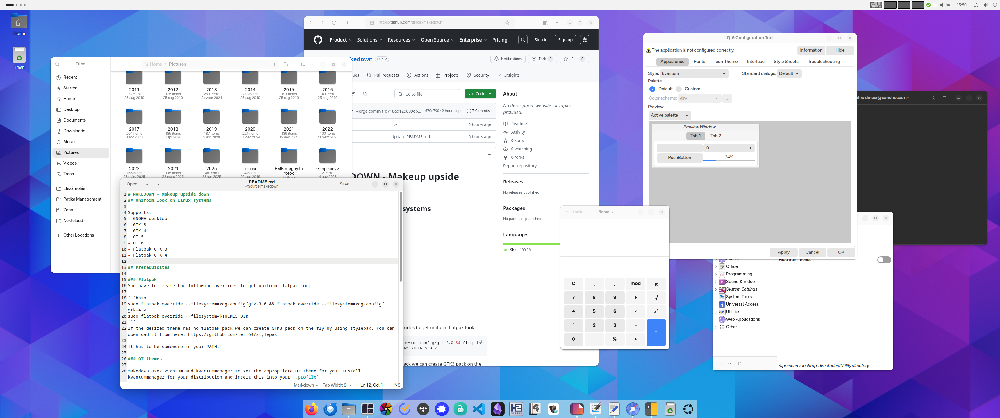

# MAKEDOWN - Makeup upside down 
## Uniform look on Linux systems

Supports:
- GNOME desktop
- GTK 3
- GTK 4
- QT 5
- QT 6
- Flatpak GTK 3
- Flatpak GTK 4

## Prerequisites

### Flatpak
You have to create the following overrides to get uniform flatpak look.

```bash
sudo flatpak override --filesystem=xdg-config/gtk-3.0 && flatpak override --filesystem=xdg-config/gtk-4.0
sudo flatpak override --filesystem=$THEMES_DIR
```
If the desired theme has no flatpak pack we can create GTK3 pack on the fly by using stylepak. You can download it from here: https://github.com/refi64/stylepak

It has to be somewere in your PATH.

### QT themes

makedown uses kvantum and kvantummanager to set the appropriate QT theme for you. Install kvantummanager for your distribution and insert this into your `,profile`

```bash
export QT_QPA_PLATFORMTHEME=kvantum
export QT_STYLE_OVERRIDE=kvantum
```

## Install
- Copy makedown anywhere in your PATH,
- set `THEMES_DIR` and `THEMES_DIR` if needed.

## Usage

```bash
makedown THEME_NAME KVANTUM_THEME_NAME
```
### Fully suported themes
#### Colloid 

Download: [GTK](https://github.com/vinceliuice/Colloid-gtk-theme) [Kvantum](https://github.com/vinceliuice/Colloid-kde)

#### Yaru-*
makedown suports Ubuntu Yaru (Orange) theme. *There is no kvantum theme for the modern color versions, therefore it is not fully supported.*

```bash
cp -r /usr/share/themes/Yaru ~/.themes/
```
#### Dracula

Download: [Dracula](https://draculatheme.com/)

#### WhiteSur
Download:  [GTK](https://github.com/vinceliuice/WhiteSur-gtk-theme) [Kvantum](https://github.com/vinceliuice/WhiteSur-kde)

### Create your own
The bottleneck of modern desktop theming is that GTK4 does not support theming except some custum color and the buttons on the titlebar. Therefore I suggest to start with a theme that supports GTK4 and also GTK3. Copy it to your `.theme` folder than create or search for a correcponding kvantum theme and copy it to `.config/Kvantum` folder.

Now you can use makedown to do the rest.

