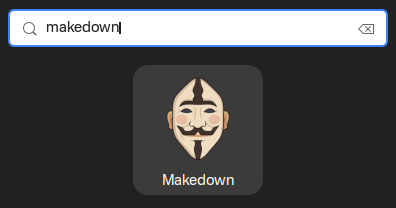
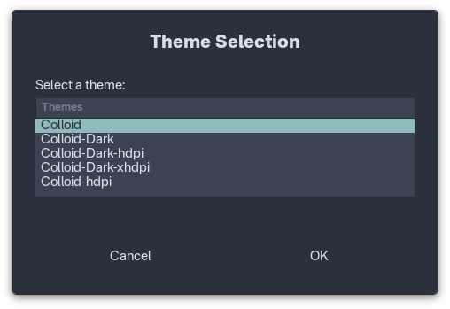
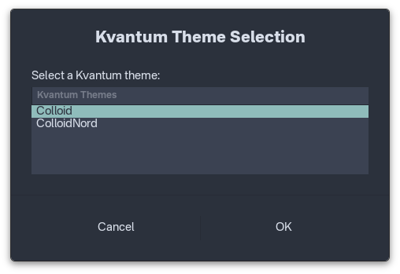
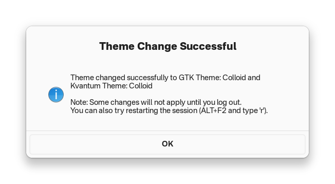

# **makedown** (makeup upside down)
## Theming Solution for Linux Desktop


*Example: Nordic theme applied consistently across GTK and Qt applications*

A comprehensive theme management script that provides a unified theming experience across different desktop environments and applications on Linux systems.

## Features

**makedown** supports theming for:
- **GNOME desktop environment**
- **GTK 3 applications**
- **GTK 4 applications** 
- **Qt 5 applications**
- **Qt 6 applications**
- **Flatpak GTK 3 applications**
- **Flatpak GTK 4 applications**

**makedown** main features:
- **Automatic theme detection and mapping**
- **Interactive theme selection via GUI**
- **Command-line interface for automation**

## Recommended Themes

Most available themes do not provide full support for all required components (GTK3, GTK4, Kvantum, GNOME Shell, etc.). It is common for a theme to look great in GTK3 applications but lack proper styling for GTK4 or Kvantum (Qt) apps, or vice versa. 

Even the default GNOME (Adwaita) theme does not look exactly the same between GTK3 and GTK4 applications.

For the most consistent experience, choose themes that explicitly mention support for all relevant toolkits and desktop environments, or consider mixing and matching similar-looking themes for GTK and Qt. Always review the theme's documentation and test it on your system to ensure it meets your needs.

However, the following themes offer excellent compatibility and consistent appearance across all supported toolkits and environments.

- Nordic [(GTK)](https://github.com/EliverLara/Nordic) | [(KDE)](https://github.com/EliverLara/Nordic/tree/master/kde/kvantum)
- Colloid [(GTK)](https://github.com/vinceliuice/Colloid-gtk-theme) | [(KDE)](https://github.com/vinceliuice/Colloid-kde)
- Dracula [(GTK)](https://github.com/dracula/gtk) | [(KDE)](https://github.com/dracula/gtk/tree/master/kde/kvantum)
- WhiteSur [(GTK)](https://github.com/vinceliuice/WhiteSur-gtk-theme) | [(KDE)](https://github.com/vinceliuice/WhiteSur-kde)

## Prerequisites

### Required Dependencies
- `zenity` - For GUI dialogs
- `gsettings` - For GNOME theme configuration
- `kvantummanager` - For Qt theme management
- `stylepak` - For Flatpak theme generation (optional)

### Flatpak Configuration
**makedown** tries to set some nescessary flatpak overrides if they are not set, already: 
```
filesystem=xdg-config/gtk-3.0
filesystem=xdg-config/gtk-4.0
filesystem=$THEMES_DIR
```

These operations require root (administrator) privileges.
If you do not have root access, please contact your system administrator to perform these actions for you.

### Stylepak Setup
If your desired theme doesn't have a Flatpak pack, **makedown** can create GTK3 packs on-the-fly using stylepak:

1. Download stylepak from: https://github.com/refi64/stylepak
2. Install it somewhere in your `$PATH`
3. **makedown** will automatically use it when needed

### Qt Theme Configuration

**makedown** uses Kvantum for Qt application theming. After installing `kvantummanager`, add these lines to your shell profile (`.profile`, `.bashrc`, or `.zshrc`):

```bash
export QT_QPA_PLATFORMTHEME=kvantum
export QT_STYLE_OVERRIDE=kvantum
```

## Installation

### Method 1: Manual Installation
1. Copy the `makedown` script to any directory in your `$PATH` (e.g., `/usr/local/bin/` or `~/bin/`)
2. Make it executable: `chmod +x makedown`


### Method 2: Local Installation
```bash
# Clone or download the repository
git clone https://github.com/dincsi/makedown.git
cd makedown

# Copy to local bin directory
mkdir -p ~/bin
cp bin/makedown ~/bin/
chmod +x ~/bin/makedown

# Add ~/bin to PATH if not already present
echo 'export PATH="$HOME/bin:$PATH"' >> ~/.bashrc
source ~/.bashrc
```

### Optional Steps
1. If you want to add a desktop icon/launcher:
    - Copy the `share/applications/makedown.desktop` file to your local applications directory:
      ```bash
      mkdir -p ~/.local/share/applications
      cp share/applications/makedown.desktop ~/.local/share/applications/
      ```
    - Copy the `share/pixmaps/makedown.png` icon file to your local pixmaps directory:
        ```bash
        mkdir -p ~/.local/share/icons
        cp share/pixmaps/makedown.png ~/.local/share/icons/
        ```
2. You can modify the `THEMES_DIR` and `CONFIG_DIR` variables in the script if you use custom locations

### Method 3: Install from .deb package (Recommended for Ubuntu/Debian)
1. Go to the [Releases page](https://github.com/dincsi/makedown/releases) and download the latest `makedown.deb` file.
2. Install the package with:
   ```bash
   sudo dpkg -i makedown.deb
   sudo apt-get install -f  # (optional, to fix dependencies)
   ```

## Usage

### Interactive Mode (Recommended)
Launch the GUI theme selector in terminal:
```bash
makedown
```
or click on the makedown icon:



This will:
1. Show a dialog to select from available GTK themes



2. Automatically filter and show matching Kvantum themes if exists



3. Apply all theme settings across the system



### Command Line Mode
If you know exactly which themes to apply:
```bash
makedown THEME_NAME [KVANTUM_THEME_NAME]
```

Examples:
```bash
makedown "Yaru"
makedown "WhiteSur-Light" "WhiteSur"
makedown "Colloid-Light" "Colloid"
```

### Automatic Theme Mapping
**makedown** includes automatic theme mapping for popular themes:
- `Colloid-Light` → `Colloid` (Kvantum)
- `WhiteSur-Light` → `WhiteSur` (Kvantum)
- `Yaru` → `KvYaru` (Kvantum)

## Theme Management

### Supported Theme Locations
- **User themes**: `~/.themes/`
- **System themes**: `/usr/share/themes/`
- **User Kvantum themes**: `~/.config/Kvantum/`
- **System Kvantum themes**: `/usr/share/Kvantum/`

### Creating Custom Themes
The main limitation of modern desktop theming is that GTK4 has limited theming support compared to GTK3. We recommend:

1. **Start with a GTK4-compatible theme** that also supports GTK3
2. **Copy the theme** to your `~/.themes/` directory
3. **Find or create a matching Kvantum theme** and place it in `~/.config/Kvantum/`
4. **Use makedown** to apply the theme consistently across all applications

### Theme Structure
A complete theme should include:
```
~/.themes/YourTheme/
├── gtk-3.0/
│   ├── gtk.css
│   └── gtk-dark.css
├── gtk-4.0/
│   ├── gtk.css
│   └── gtk-dark.css
├── gnome-shell/
│   └── gnome-shell.css
└── assets/
    └── (theme assets)

~/.config/Kvantum/YourKvantumTheme/
├── YourKvantumTheme.kvconfig
└── YourKvantumTheme.svg
```

## Troubleshooting

### Common Issues
- **Theme not applying**: Try logging out and back in, or restart the session with `Alt+F2` → `r`
- **Flatpak apps not themed**: Ensure flatpak overrides are set correctly
- **Qt apps not themed**: Verify Kvantum environment variables are set
- **GNOME Shell theme not working**: Install and enable the User Themes extension
- **No titlebar buttons on flatpak Thunderbird**: Set `mail.tabs.drawInTitlebar` to false

### Manual Session Restart
Some theme changes require a session restart. You can:
1. Log out and log back in
2. Restart GNOME Shell: `Alt+F2` → type `r` → Enter

## Contributing

Feel free to contribute by:
- Adding support for more theme mappings
- Improving error handling
- Adding support for additional desktop environments
- Reporting bugs or suggesting features

## License

This project is open source. Please check the license file for details.

